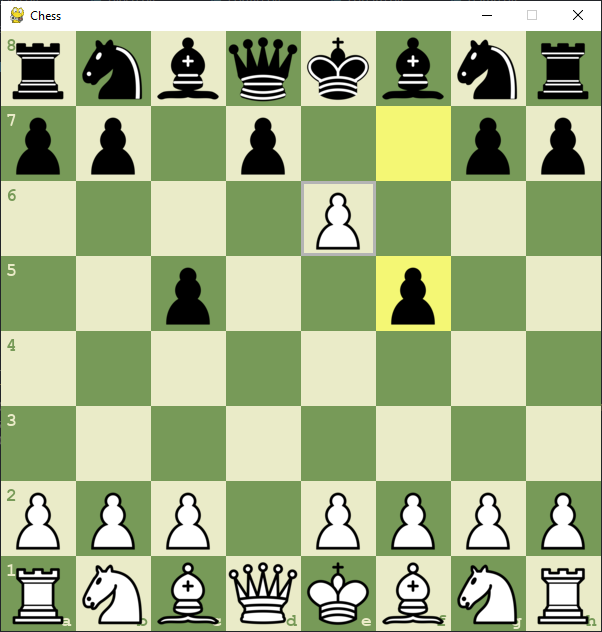

# Chess

Simple chess game made in python with pygame. Press `R` to reset board and `T` to change theme.

it works as a normal chess game. white starts first, you can play by dragging and dropping your pieces.

# Download
to play the game either download the source code from the github release and run the `main.py` file in the `src` folder or download and run the `game.exe` file.

